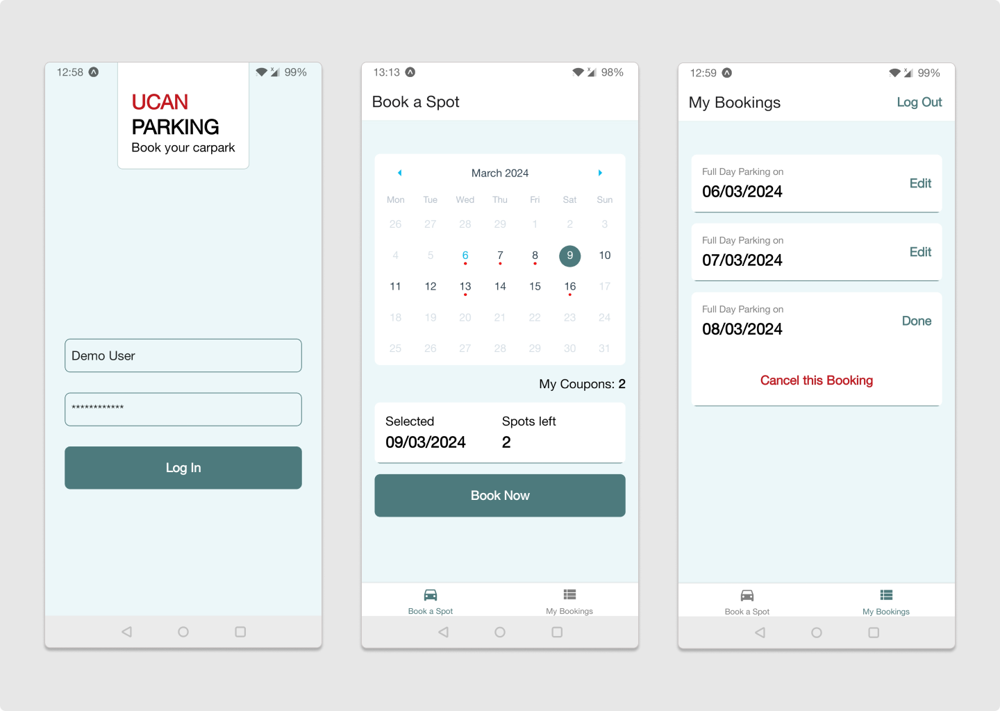
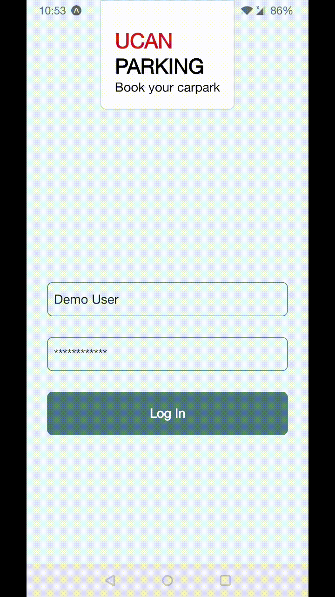

# UcanPark: Mobile Carpark Booking App

UcanPark is a mobile application prototype to simplify carpark bookings for university staff and students. It offers a convenient way to book parking spots with coupons, view existing bookings, and cancel them if needed.

## Current Version: 1.0.0

Front-end for booking flow and user interactions complete.

> Note: Data and API calls are mocked. User data is not persisted.

- Theming
- Login and Logout UI
- Carpark bookings screen
- Bookings management screen

## Tech Stack:

- React Native
- TypeScript

## Getting Started

- Clone the repository
- Install dependencies

  ```
  cd UcanPark
  npm install
  ```

- Install [Expo Go](https://docs.expo.dev/get-started/expo-go/) on your mobile device
- Start the app.
  ```
  npm start
  ```
  Expo CLI will generates a QR code. On Android, open the Expo Go app on your device and scan the QR code to connect to the dev server. On iOS, use the device's camera to scan the QR code.

## Screenshots (on an Android phone)



A quick demo:


